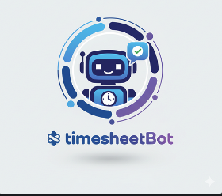

# TimesheetBot

**TimesheetBot** is a Slack-based automation tool designed to streamline timesheet submissions and reporting within your Slack workspace.

This internal bot makes timesheet management simple and efficient by allowing employees to log, view, edit, and submit their timesheets without ever leaving Slack. By reducing manual effort, it helps teams maintain consistent project reporting while saving valuable time.

Users can easily post their weekly and monthly work summaries, and managers can quickly access detailed reports — all through intuitive slash commands.

## Available Commands

- **/posttimesheetweekly**  
  Submit your weekly hours and activity summary directly from Slack.

- **/posttimesheetmonthly**  
  Log and submit your complete monthly work summary.

- **/gettimesheetweeklyreport**  
  Instantly fetch a team-wide weekly report for review.

- **/gettimesheetmonthlyreport**  
  Generate and view detailed monthly reports and analytics.

- **/edit_timesheet**  
  Edit your most recently submitted timesheet.

